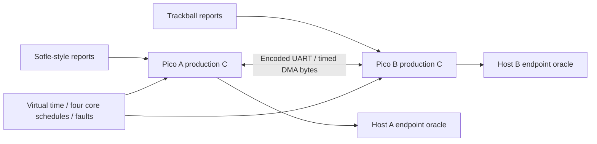

# Hardware-free DeskHop testing

This framework tests the firmware on a development computer or in CI. It needs
no Pico, keyboard, trackball, software on either target Mac, or network access
for its normal tiers. Start with the [architecture decision](architecture.md)
and [coverage/fidelity matrix](coverage.md). The optional emulator experiment
requires a pinned npm download; ordinary tests use checked-in source only.
The [validation record](validation.md) records the completed local runs and ARM artifact.
The [diagnostics walking skeleton](../diagnostics.md) describes the staged
hardware checks. The serial console was deployed in v0.95, and v0.96's disk-free
maintenance entry passed on Pico A. The [v0.97 peer-status deployment](peer-status-v097.md)
adds real paired UART/queue checks and asynchronous console tests. The physical
serial check confirmed both boards executing v0.97 in six successful peer
queries; Benji confirmed the input check passed with no replug needed. A's firmware was
independently read back, while B's result establishes its executing identity
and boot metadata, not flash integrity.
The device-stack harness now
also executes real CDC control/bulk transfers and the production console,
including bounded work, malformed command recovery, and HID progress while a
serial reader is stalled. The paired adapter derives task names and core
ownership from each firmware's tables, including older baseline builds.

## Commands

From the repository root:

```sh
export CC=clang
python3 tests/run.py fast
python3 tests/run.py deep
python3 tests/coverage.py
python3 tests/run.py arm
```

Requirements: Python 3.10+, Clang with AddressSanitizer/UndefinedBehaviorSanitizer, and Node
for the existing Web Config test. `CC` and `NODE` override their executables.
The runner can also find Codex's bundled Node when it is absent from PATH.
Coverage needs LLVM (`llvm-cov`, `llvm-profdata`; Xcode's `xcrun` works on macOS).
Use matching Clang/LLVM versions; on Linux their shared `bin` directory may need
to be added to PATH. The deep CI workflow selects these tools explicitly.
The ARM tier additionally needs CMake and an ARM GNU toolchain with newlib;
on this machine it prepends `/opt/homebrew/opt/arm-gcc-bin@14/bin` as recorded
in the runbook. No command flashes or uploads firmware.

- **Fast:** all seven original suites (HID receiver checks expanded to every ID 0–255); 2,000 generated HID descriptors with
  exact-sized report buffers and independent bit-level extraction oracle;
  64,128 production updater contract cases; exhaustive finite flash model;
  full-size production storage transactions; real TinyUSB device and host
  stacks against virtual controllers; paired production scenarios; sanitizer
  checks of mouse inputs; simulator isolation, bounded-wait, replay and
  minimization checks. The finite model reports the remaining update power-loss
  counterexample separately.
- **Deep:** fast tier plus 20,000 HID cases, 16 storage seeds, 32 generated
  paired-input sequences, the backpressure scenario under all 24 fixed priority
  orders of the four modeled cores, and 26 compiled production mutations
  (11 storage and 15 paired, including seven selection mutations).
  Model mutations are counted separately. Nine valid-input scenarios also run
  against original `d42c930` source (Git and that local commit are required;
  no fetching). Four host-effect traces match exactly; five compare ordered
  effects per host, suppressing only redundant keyboard states and allowing
  at most one modeled HID poll (1 ms) of timestamp drift. Mouse effects are
  never collapsed. New UART reconciliation traffic is excluded. This is bounded
  exploration, not every instruction interleaving or physical timing equivalence.
- **Coverage:** source coverage artifacts in `build/tests/coverage`. Read the
  report's layer/denominator description; compilation does not imply execution,
  and percentages do not establish correctness.
- **ARM:** build `build/arm-validation/deskhop.uf2`, `.elf`, and `.bin` from the
  same production sources, with all SDK/Pico-PIO-USB hardware code included.

The existing Build workflow runs the fast tier before its ARM build. The
manually dispatched Deep firmware tests workflow runs the deep tier and
coverage on Linux and macOS, retaining results and failure artifacts. CI has
been configured in this branch; a remote CI run requires publishing it.
Each tier saves `build/tests/results-<tier>.json`; `results.json` holds the latest
tier. Failure inputs and coverage are retained separately.

## What runs where



The paired engine loads two separate shared libraries. Each has its own full
production state, file statics, real Pico SDK queue implementation, and native
copies of the application units listed in `tests/sim/build.py`. It executes the
actual mouse decoder, HID parser, keyboard routing/hotkeys, LED/zoom/activity
policies, UART framing/receiver, queue tasks, and update handlers. It does not
copy their algorithms into Python.

`main.c`'s task tables are read at build time. Each core runs the tasks in that
production order; independent core passes and DMA byte arrivals share a
virtual-clock event queue. The default 250 µs top-loop polling quantum is an
explicit modeling parameter, not a measured CPU speed. Production deadline
checks decide when tasks run. Precise timer scenarios can invoke an individual
production task at a stated deadline without running unrelated polls.

A blocked queue yields to other available cores and DMA. A two-second virtual
wait bound produces a test failure and trace rather than hanging forever.
Host endpoints can be unavailable, suspended, or reject a send after readiness;
successful HID transfers occupy the modeled endpoint for its 1 ms interval.
Watchdog expiration stops execution of that modeled node. It does not execute
RP2040 ROM startup; re-enumeration and persistent-power behavior have separate
USB/storage tests.

The actual TinyUSB stacks also run in independent executables:

- [Device stack](../../tests/usb_stack/README.md): control transfers, descriptors,
  enumeration, endpoint completion, LED OUT, suspend/resume and MSC transport.
- [Host stack](../../tests/usb_host/README.md): peripheral enumeration and
  interrupt transfers through a virtual HCD and production callbacks.
- [Storage](../../tests/storage/README.md): actual UF2, config and peer-update
  code over a modeled NOR array, including full image transfers and torn writes.
- [Formal model](../../tests/model/README.md): a finite specification of source
  ownership, flash exclusion and reset guards, with shortest counterexamples.
- [Emulation probe](../../tests/emulation/README.md): two ARM-executing RP2040js
  instances exchange UART bytes; missing per-Pico support prevents full boot.

These layers are complementary. The real USB stacks and the paired application
scheduler are not one fully composed PIO/USB/CPU emulation.

## Author a scenario

Add a `scenario_name(sim)` function and register it in `tests/sim/run.py`'s
scenario collection (normally via `test_transport.py` or `test_behaviors.py`).
For example:

```python
from fixtures import attach, mouse
from test_transport import out_mouse

def scenario_remote_wheel(sim):
    attach(sim)
    sim.do(1, 'report', 1, 0, mouse(wheel=-2))
    sim.advance(5000)                  # virtual microseconds
    sim.expect_report(0, 2, out_mouse(0, 16000, 16000, wheel=-2))
    sim.expect(0, 'x', 16000)
```

The expected report is independently packed from the HID contract, never
obtained by calling the production encoder. Use `expect`, `expect_report`, or
`check` for every property so failures retain their oracle during replay.
`check` supports keyboard-usage absence, numeric ranges, elapsed-time bounds,
host report counts and bytes within an indexed host report. Internal state expectations complement host-observable
oracles; they should not replace them.

Useful actions include `host`, `mount`, `unmount`, `report`, `led`, `endpoint`,
`pause` (one core), `fill` (real bounded queues), and `fault`. `set` configures
fixtures or deliberately poisons cached state; it is not a user-input path.
`raw` injects independent UART bytes into the actual DMA ring receiver.
A `checkpoint` can change endpoint state between readiness and report submission.

```python
sim.do(1, 'fault', {'delay': 20000, 'xor': 1})  # next packet's payload damaged
sim.do(0, 'endpoint', 0, 1, 0)                # stall primary HID endpoint
sim.do(1, 'pause', 1, 100000)                 # pause B core1 for 100 ms
```

UART fault keys are `delay` (persistent added latency), `drop` (next N packets),
`xor` (one next payload byte), `truncate` (next packet length) and `duplicate`
(one next packet). FIFO serialization and DMA byte arrival remain explicit;
the model does not invent UART acknowledgements absent from the firmware.

## Reproduce and reduce a failure

```sh
python3 tests/sim/run.py --scenario generated --seed 73
python3 tests/sim/run.py --scenario mouse_output_switch_held
python3 tests/sim/test_harness.py
python3 tests/sim/run.py --replay build/tests/replay-contract.json
python3 tests/sim/run.py --minimize build/tests/replay-contract.json
python3 tests/sim/run.py --replay build/tests/replay-contract.min.json
```

Replaying a failing case intentionally exits nonzero with the same assertion.
JSON contains the seed, native-library SHA-256, input/expectation steps, core
order, quantum and timestamped USB/UART (including received bytes), LED, reset
and fault events with the executing core/domain. Exact trace equality is tested on a successful
record/replay. Reduction deletes input actions while retaining the same failing
assertion; the result is 1-minimal under action deletion, not a globally shortest
trace or a minimization of arbitrary data values. The apparatus deliberately
drops delivery and then requires the missing report. Its retained source-position
precondition prevents deletion of the input from manufacturing the same failure;
the current check reduces that intentional delivery failure from 21 to 9 steps.

HID inputs can be reproduced with the seed/case CLI in
[the HID boundary documentation](../../tests/hid_stubs/README.md). Storage
failures print their seed and optionally produce JSONL. Finite model failures
are shortest breadth-first traces and have their own replay command.

## Current production findings

This branch targets **v0.94**, configuration format **10**. It adds narrow fixes
found by the new tests: descriptor/report length checks and bounded parser work;
correct wide scalar extraction; rejection of invalid descriptor layouts before
keyboard fallback; valid three-byte boot mouse handling; saturated wide mouse
motion and safe coordinate arithmetic; and rejected invalid output indices.
Ordinary preserved behavior remains covered by the original and new scenarios.

Mouse buttons now retain each local interface's mask separately from peer input.
The regressions cover overlapping holds, releases, detach, split report IDs,
truncated fragments, both output directions and absolute/relative reports.
F24 switching releases both old-host mouse interfaces while preserving physical
holds for subsequent input. A late physical packet cannot press the old host
again, and bounded queue admission requests recovery if a critical all-up cannot
enqueue. Explicit synthetic reports preserve macOS desktop nudges without
copying peer buttons into the relative HID interface.

Selection uses runtime generation/origin tokens and periodic reconciliation.
The tests cover bounded convergence after modeled link recovery, duplicates,
reordering, concurrent selections, startup/join and counter wrap. This assumes
recurring heartbeat polls, eventual delivery and fewer than 2**31 outstanding
generations; permanent link loss has no convergence guarantee. Full mouse and
selection semantics require both Picos to run the upgraded firmware. Legacy
selection commands and physical mouse reports remain accepted, while mixed
firmware cannot supply the new reconciliation and explicit-synthetic guarantees.

Configuration saves compute their checksum from a coherent snapshot protected
against known config writers. A deterministic real SET_VAL/save interleaving
checks both the persisted bytes and a later edit's preservation in RAM. The short
RAM lock ends before flash operations; this does not establish every live config
reader's race freedom.

Safe boot after arbitrary interrupted running-slot updates and the existing
multiple-keyboard-report collection limitation remain open. See the
[matrix](coverage.md) before interpreting a green tier. The current scenario
inventory is generated by `python3 tests/sim/run.py --help`; completed overall
validation belongs in the dated validation record.
Hardware USB/PIO timing, electrical behavior, RP2040 weak-memory/instruction
races, real Mac idle timers and Karabiner state still need independent evidence.
